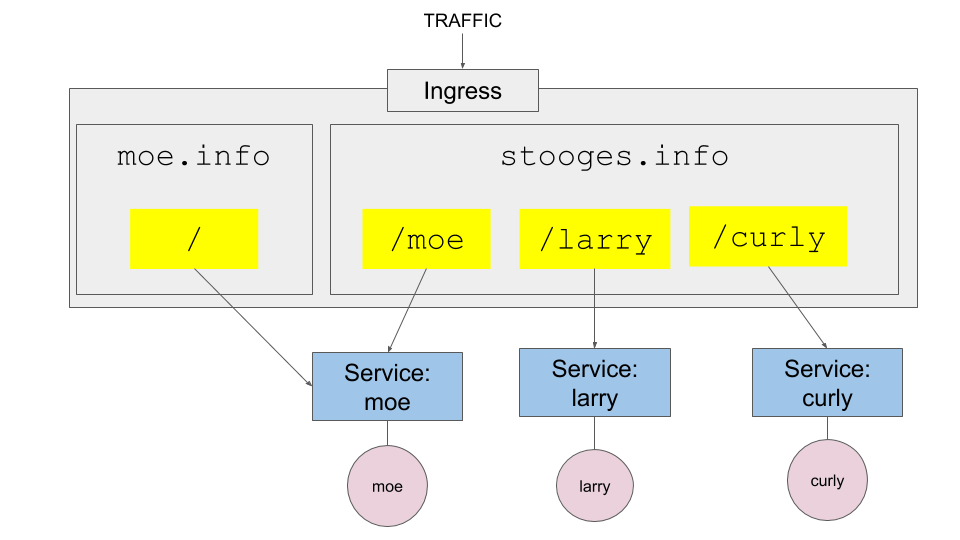

# Working with Kubernetes Ingress

The purpose of this exercise is to demonstrate how to use a Kubernetes Ingress
controller to round traffic to a service according to a domain name and route
as defined by a URL. 



## The Ingress Manifest

The steps that follow will implement a Kubernetes Ingress as defined in the following
manifest.

```yaml
apiVersion: extensions/v1beta1
kind: Ingress
metadata:
  name: stooges-ingress
spec:
  backend:
    serviceName: stooges
    servicePort: 80
  rules:
    - host: moe.info
      http:
        paths:
        - path: /
          backend:
            serviceName: moe
            servicePort: 3000
    - host: stooges.info
      http:
        paths:
        - path: /moe
          backend:
            serviceName: moe
            servicePort: 3000
        - path: /larry
          backend:
            serviceName: larry
            servicePort: 3000
        - path: /curly
          backend:
            serviceName: curly
            servicePort: 3000
```

## Implementing an Ingress

We'll use a Katacoda Minikube Playground as our development and deployment environment.

**Step 1:** Go to the Katacoda Minikube Playground.

`https://katacoda.com/javajon/courses/kubernetes-fundamentals/minikube`

**Step 2:** Enable the Minikube Ingress Controller

`minikube addons enable ingress`

**Step 3:** Clone the exercise source code from GitHub

`git clone https://github.com/reselbob/k8sdemos`

**Step 4:** Navigate to the exercise's source code

`cd k8sdemos/ingress`

**Step 5:** Create the Deployments

`kubectl apply -f moe-deployment.yaml`

`kubectl apply -f larry-deployment.yaml`

`kubectl apply -f curly-deployment.yaml`

**Step 6:** Create the Services

`kubectl expose deployment moe --target-port=3000 --type=NodePort`

`kubectl expose deployment larry --target-port=3000 --type=NodePort`

`kubectl expose deployment curly --target-port=3000 --type=NodePort`

**Step 7:** Set Up the Local DNS to `moe.info` and `stooges.info` by making an entry into `/etc/hosts`

Linux and MAC users, do this step do this:

`echo "$(minikube ip) stooges.info moe.info" | sudo tee -a /etc/hosts`

Windows users follow the process described here **[here](https://www.addictivetips.com/windows-tips/modify-the-hosts-file-on-windows-10/)**.


**Step 8:** Apply the Ingress

`kubectl apply -f ingress.yaml`

**Step 9:** Take a look

`curl http://moe.info | grep STOOGE`

`curl http://stooges.info/moe | grep STOOGE`

`curl http://stooges.info/larry | grep STOOGE`

`curl http://stooges.info/curly | grep STOOGE`

## Clean Up


`kubectl delete service moe`

------

`kubectl delete deployment moe`

------

`kubectl delete service larry`

------

`kubectl delete deployment larry`

------

`kubectl delete service curly`

------

`kubectl delete deployment curly`

------

`kubectl delete ingress stooges-ingress`

------