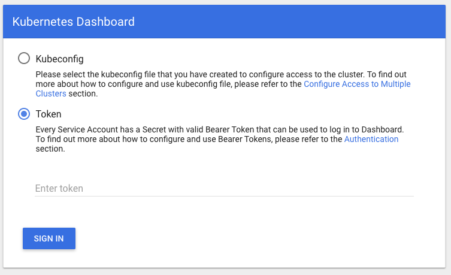
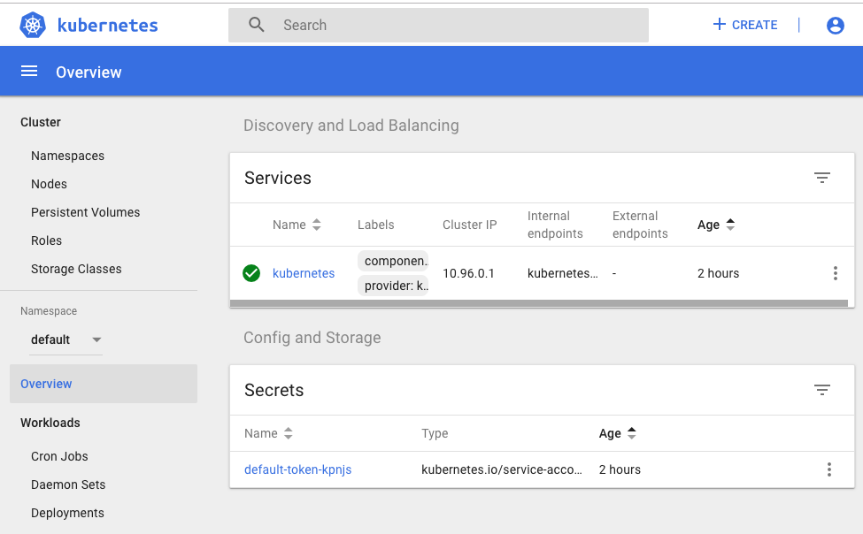

# Dashboard

The best way to do this demo is using the Katacoda Kubernetes Playground found [here](https://katacoda.com/courses/kubernetes/playground).

**Step 1:** Apply the dashboard artifacts directly from Kubernetes

`kubectl apply -f https://raw.githubusercontent.com/kubernetes/dashboard/v1.10.1/src/deploy/recommended/kubernetes-dashboard.yaml`

**Step 2:*** Turn on the proxy to expose the local cluster

`kubectl proxy --address="0.0.0.0" -p 8001 --accept-hosts='^*$'`

Doing this well tie up the terminal window.

**Step 3:** In a **new terminal window** execute the get the access token you're going to need to login to the
dashboard.

`kubectl -n kube-system describe secret $(kubectl -n kube-system get secret | awk '/^deployment-controller-token-/{print $1}') | awk '$1=="token:"{print $2}'`

Save the token.

**Step 4:** Open a web page using the Katacoda webpage access feature ...

and enter the port `8001`

You'll get a weird rendering of a list of filenames in the web page. This is OK. Take notice fo the Katacoda URL in the web 
age.

**Step 5:** Append the following to the Katacoda URL:

`/api/v1/namespaces/kube-system/services/https:kubernetes-dashboard:/proxy/#!/overview?namespace=default`

For example:

`https://2886795274-8001-cykoria01.environments.katacoda.com/api/v1/namespaces/kube-system/services/https:kubernetes-dashboard:/proxy/#!/overview?namespace=default`

**WHERE** 

`https://2886795274-8001-cykoria01.environments.katacoda.com` is the specific Katacoda URL.

Invoke the URL in the brower. This will take you to the Kubernetes Dashboard login page.

**Step 6:** Select the option `Token` in the Kubernetes Dashboard Login Page and appl the token you saved earlier.

**Congratulations, you're in!!!!***

