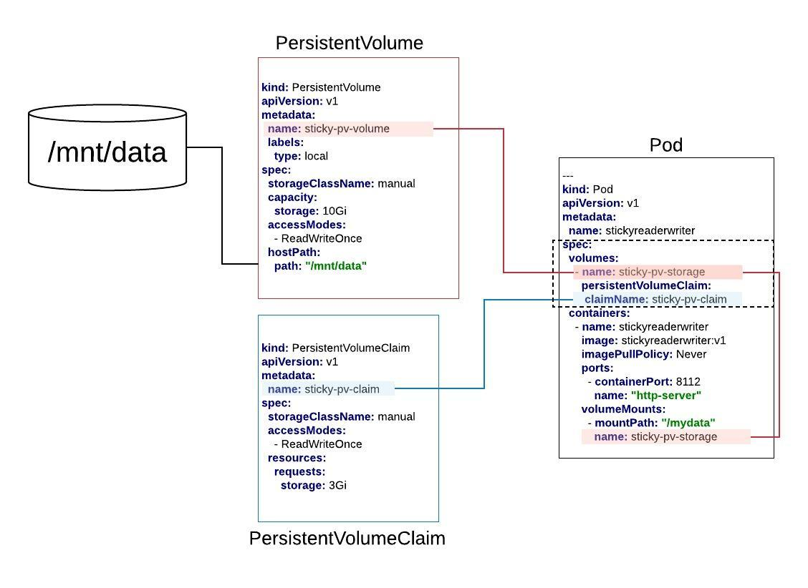

# Persistent Volumes



## Set up the storage

**Step 1:** Go to the Katacoda K8S Playground

`https://katacoda.com/courses/kubernetes/playground`

**Step 3:**

`cd /mnt`

`sudo -s`

`mkdir /mnt/data/`

`chmod 775 /mnt/data`

`touch /mnt/data/hi.there`

`ls /mnt/data`

Exit minikube

`exit`


## Create the Persistent Volume

`kubectl apply -f sticky-pv.yaml`

## Create the Persistent Volume Claim

`kubectl apply -f sticky-pvc.yaml`

## Deploy the Test Application

`kubectl apply -f sticky-deployment.yaml`

## Make a Request on the Test App

`kubectl get pods | grep stickyreaderwriter`

`kubectl exec -it stickyreaderwriter_A_GUID sh`

`curl localhost:8112`

## Check Activity in Storage

SSH into minikube:

`minikube ssh`

Look at the file

`cat /mnt/data/test_file.txt`

Exit minikube

`exit`


## Scale Up the Number of Pods in the Deployment

`kubectl edit deployments/stickyreaderwriter`

Search for, `replicas: 1` under `spec` and change to, `replicas: 4`

## Make a Request on a new Pod

`kubectl exec -it stickyreaderwriter_A_GUID -- sh`

`curl localhost:8112`

## Check Activity in Storage

SSH into minikube:

`minikube ssh`

`cat /mnt/data/test_file.txt`

Exit minikube

`exit`

## Manifests

### Persistent Volume Manifest
```yaml

kind: PersistentVolume
apiVersion: v1
metadata:
  name: sticky-pv-volume
  labels:
    type: local
spec:
  storageClassName: manual
  capacity:
    storage: 10Gi
  accessModes:
    - ReadWriteOnce
  hostPath:
    path: "/mnt/data"

```

### Persistent Volume Claim Manifest
```yaml
kind: PersistentVolumeClaim
apiVersion: v1
metadata:
  name: sticky-pv-claim
spec:
  storageClassName: manual
  accessModes:
    - ReadWriteOnce
  resources:
    requests:
      storage: 2Gi

```


###  Deployment Manifest
```yaml
apiVersion: extensions/v1beta1
kind: Deployment
metadata:
  name: stickyreaderwriter
spec:
  replicas: 1
  selector:
    matchLabels:
      app: stickyreaderwriter
  template:
    metadata:
      labels:
        app: stickyreaderwriter
    spec:
      volumes:
        - name: sticky-pv-storage
          persistentVolumeClaim:
           claimName: sticky-pv-claim
      containers:
        - name: stickyreaderwriter
          image: reselbob/stickyreaderwriter:v1
          imagePullPolicy: Always
          ports:
            - containerPort: 8112
              name: "http-server"
          volumeMounts:
            - mountPath: "/mydata"
              name: sticky-pv-storage

```

## Application Code

```javascript
const http = require('http');
const fs = require('fs');
let i = 0;

const port = process.env.PORT || 8112;

const handleRequest = function(request, response) {
    const fname = '/mydata/test_file.txt';
    const str = `${i} as ${new Date()} for processId: ${process.pid} \n`;
    i++;
    fs.appendFileSync(fname, str, function (err) {
        if (err) {
            return console.log(err);
        }
    });
    console.log('Received request for URL: ' + request.url);
    const contents = fs.readFileSync(fname, 'utf8');
    response.writeHead(200);
    response.end(contents);
}
const www = http.createServer(handleRequest);
www.listen(port, ()=>{
    console.log(`Listening on port ${port}`);
});
```